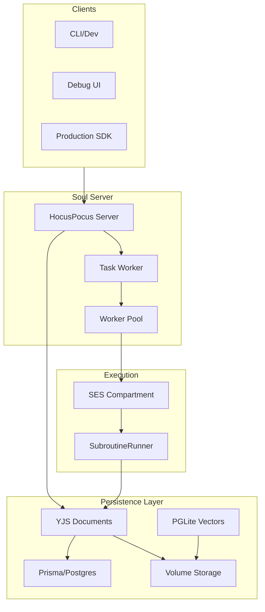
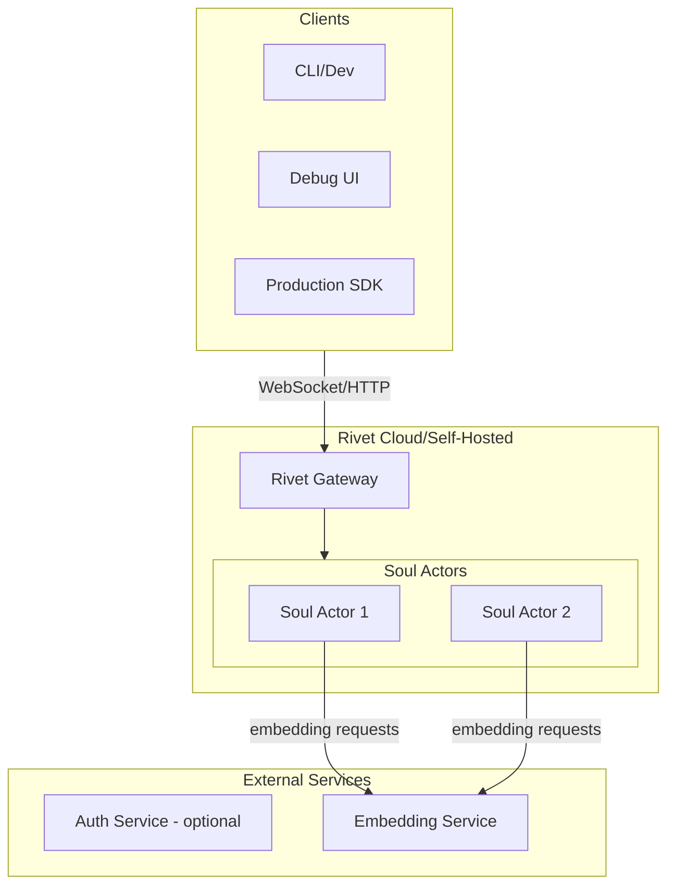

# Rivet Actors Migration for Soul Engine Cloud

## Current Architecture Summary

The soul-engine-cloud has these interconnected systems:



**Key files:**
- [`server/server.ts`](packages/soul-engine-cloud/src/server/server.ts) - Main HocusPocus server, task coordination
- [`subroutineRunner.ts`](packages/soul-engine-cloud/src/subroutineRunner.ts) - Mental process execution engine
- [`subroutineState.ts`](packages/soul-engine-cloud/src/subroutineState.ts) - State shape definitions
- [`eventLog.ts`](packages/soul-engine-cloud/src/eventLog.ts) - Event system
- [`storage/soulStores.ts`](packages/soul-engine-cloud/src/storage/soulStores.ts) - Vector store (useSoulMemory, useSoulStore)
- [`code/soulCompartment.ts`](packages/soul-engine-cloud/src/code/soulCompartment.ts) - SES sandboxing
- [`worker/worker.ts`](packages/soul-engine-cloud/src/worker/worker.ts) - IPC worker processes

---

## Proposed Rivet Architecture



### Actor Model (2 actors per soul)

**Option A: Dual Actor Model**
1. **MainThreadActor** - Handles perceptions, executes mental processes
2. **SubprocessActor** - Runs background subprocesses after main thread completes

**Option B: Single Actor Model** (simpler, recommended to start)
- One **SoulActor** handles both main thread and subprocesses sequentially
- Uses Rivet's built-in concurrency (JavaScript single-threaded model)

---

## What Gets Replaced

| Current Component | Rivet Replacement | Notes |
|-------------------|-------------------|-------|
| YJS Documents | Actor State | Automatic persistence, no CRDT overhead |
| HocusPocus Server | Rivet Gateway + Actor Events | Native WebSocket support with hibernation |
| PGLite (vectors) | Actor State + External Embedder | Store vectors in actor state, compute embeddings externally |
| Postgres/Prisma | Actor State | For soul state. Org/Auth may need separate service |
| Worker Pool + IPC | Rivet Actors | Each actor is isolated, handles its own execution |
| Task Worker | Rivet Alarms/Scheduling | Built-in scheduling API for future events |
| Volume Storage | Rivet Persistence | Automatic, same-region storage |

---

## What Should Stay

1. **SES Compartment** - Still valuable for sandboxing user-written mental processes within an actor
2. **Embedding Service** - Keep as external service (or ephemeral actor variable)
3. **Auth/Organization data** - Consider keeping minimal Postgres or external auth service

---

## Key Implementation Areas

### 1. Soul Actor Definition

```typescript
// Conceptual structure
interface SoulActorState {
  id: string;
  attributes: SubroutineAttributes;
  currentProcess: string;
  memories: Memory[];
  processMemories: Record<string, ExportedRuntimeState>;
  vectorStore: Record<string, VectorRecord>;
  memoryStore: Record<string, Json>;
  pendingScheduledEvents: Record<string, SerializedCognitiveEventAbsolute>;
  eventLog: SoulEvent[];
}

// Actor actions
- dispatchPerception(perception: Perception)
- executeMainThread()
- executeSubprocesses()
- getState()
- revert(version: string)
- scheduleEvent(event: CognitiveEvent)
```

### 2. Client Connection Pattern

Replace HocusPocus WebSocket with Rivet's hibernating WebSocket:
- Client connects to `rivet-gateway/actors/{soulKey}`
- Receives events via WebSocket subscription
- Sends perceptions via actions

### 3. Versioning/Revert

Implement snapshots in actor state:
```typescript
interface SoulActorState {
  // ... existing fields
  snapshots: Record<string, StateSnapshot>;
}
```

### 4. Broadcasting Events

Replace HocusPocus `broadcastStateless()`:
- Use Rivet's actor events system
- Clients subscribe to events via WebSocket

---

## Migration Phases

### Phase 1: Proof of Concept
- Create a minimal Rivet actor that can:
  - Accept a perception
  - Execute a simple mental process via SES
  - Persist state
  - Broadcast events
- Test with `simple-samantha` soul

### Phase 2: Feature Parity
- Implement full SubroutineRunner logic in actor
- Port useSoulMemory, useSoulStore (vector operations)
- Implement scheduling via Rivet alarms
- Support versioning/revert

### Phase 3: Migration
- Create adapter layer for existing souls
- Migrate debug UI to use Rivet connections
- Update CLI for Rivet deployment

### Phase 4: Cleanup
- Remove YJS/HocusPocus dependencies
- Remove PGLite
- Evaluate Postgres needs (auth only?)

---

## Open Questions for Clarification

1. **Auth/Organization Data**: Should org/user/API key data stay in Postgres, or move to a separate auth service?

2. **Embedding Computation**: Keep as external service, or run within actor (risk: blocks actor during computation)?

3. **Debug UI Real-time**: The current debug UI heavily relies on YJS reactivity. Rivet events work differently - acceptable to refactor UI?

4. **Multi-tenant Isolation**: Current model uses SES for code isolation. Rivet actors provide process isolation. Use both, or just Rivet?

5. **RAG System**: Current RAG uses PGLite + app-wide vector store. Move to per-soul actor state, or keep centralized?

---

## Estimated Complexity

- **High Impact, Moderate Complexity**: Replacing YJS/HocusPocus with Rivet actors
- **Moderate Impact, Low Complexity**: Replacing PGLite with actor state
- **Low Impact, High Complexity**: Maintaining backward compatibility during migration
- **Significant Refactor**: Debug UI needs to adapt to Rivet's event model

---

## Risks

1. **Lock-in**: Rivet is newer; evaluate self-hosting vs cloud trade-offs
2. **Migration Path**: Existing souls in production need seamless transition
3. **Feature Gaps**: Verify Rivet supports all needed patterns (scheduled events, versioning)
4. **Performance**: Test embedding-heavy workloads with actor hibernation patterns

---

## Implementation Checklist

- [ ] Create proof-of-concept Rivet actor with basic perception handling
- [ ] Port SubroutineRunner logic to work within Rivet actor context
- [ ] Migrate useSoulMemory/useSoulStore to use Rivet actor state
- [ ] Replace HocusPocus broadcasting with Rivet events/subscriptions
- [ ] Implement scheduled events using Rivet alarms API
- [ ] Implement state snapshots and revert functionality
- [ ] Update debug UI to connect via Rivet gateway instead of HocusPocus
- [ ] Remove YJS, HocusPocus, PGLite dependencies after migration

